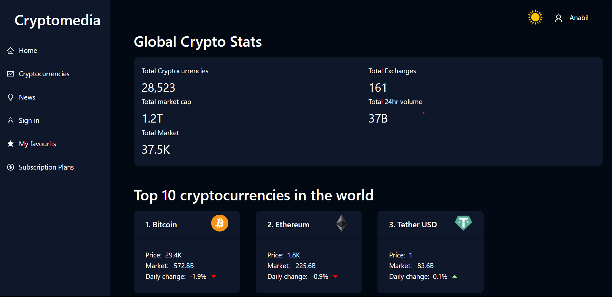

# Cryptomedia


Welcome to Cryptomedia! This application provides real-time information about cryptocurrencies, their rankings, and related news. Stay up-to-date with the latest trends, prices, and news in the crypto world with this easy-to-use web application.
## Tech stack

<div style="dispaly:flex;">
 

 

 

 

 
</div>

## Demo

https://main--dreamy-jelly-bf237f.netlify.app


## Installation

To use this app, you'll need to have Node.js , npm and mongoDB installed on your machine.

```bash
cd Cryptomedia
```
Then install the node modules and all the dependencies by running -

```bash
 npm install
```
Change the directory and start the server 

```bash
cd server

```
```bash
 nodemon server.js
```
Change the directory and start the react app

```bash
cd client
```


## Features

- Cryptocurrency List: View a list of popular cryptocurrencies, their prices, and rankings.

- Coin Details: Get detailed information about a specific cryptocurrency, including historical data and market trends.

- Microsoft News Integration: Access the latest news articles related to the cryptocurrency market.

- User Authentication: Securely sign up and log in to access personalized features.

- Favorites: Mark your favorite cryptocurrencies for quick access to their data.

- Responsive Design: Enjoy a seamless experience on both desktop and mobile devices.


## Environment Variables

To run this project, you will need to add the following environment variables to your .env file

`MONGO_URL` = mongodb://localhost:27017/My_app

`CRYPTO_API_KEY`= Your crypto api key

`BING_NEWS_API` = Your bing api


